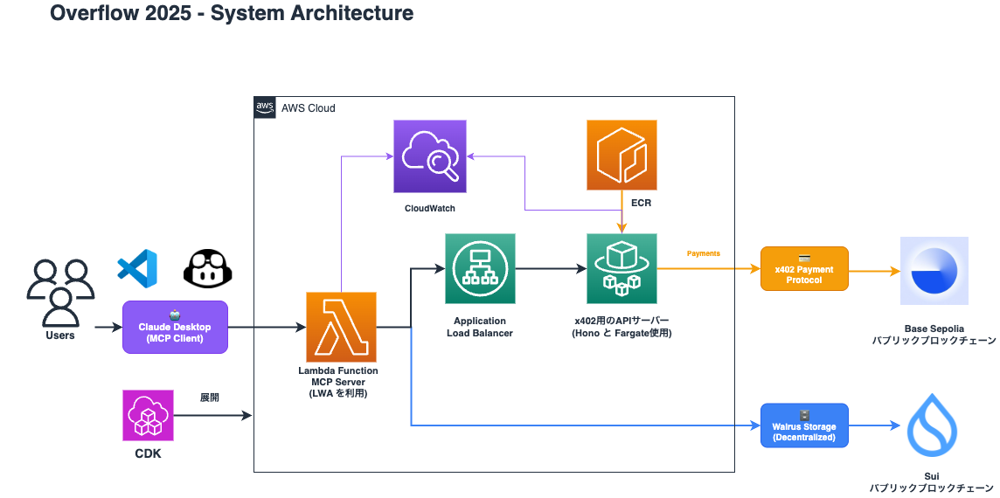

# Sui Overflow2025

[](https://github.com/AO-protocol/overflow2025/actions/workflows/build.yml)

## Project Overview

Sui Overflow2025 is a comprehensive blockchain application that demonstrates the integration of x402 payment protocol with Walrus storage through Model Context Protocol (MCP). The project features a multi-package monorepo structure with frontend, backend, MCP server, and AWS CDK infrastructure components.

## Architecture



## Project Structure

```
.
├── docs/                # Project documentation and diagrams
├── pkgs/
│   ├── frontend/        # Next.js 15 frontend with Sui wallet integration
│   ├── backend/         # Hono-based API server with x402 payment handling
│   ├── mcp/             # Model Context Protocol server for Walrus file operations
│   └── cdk/             # AWS CDK infrastructure for cloud deployment
├── .github/workflows/   # CI/CD pipeline configuration
├── biome.json          # Code linting and formatting configuration
├── pnpm-workspace.yaml # pnpm monorepo workspace configuration
└── tsconfig.json       # TypeScript base configuration
```

## Technologies

- **Package Manager**: pnpm v8+ with workspace support
- **Monorepo Structure**: pnpm workspaces for multi-package management
- **Frontend**: Next.js 15 with React 19, TypeScript, PWA support, and Sui wallet integration
- **Backend**: Hono framework with TypeScript, x402 payment protocol integration
- **MCP**: Model Context Protocol SDK for Walrus file operations and blockchain payments
- **Blockchain**: Sui blockchain integration with @mysten/dapp-kit and Sui.js
- **Payment**: x402 protocol for USDC payments on Base Sepolia
- **Storage**: Walrus decentralized storage network
- **Infrastructure**: AWS CDK for cloud deployment and Lambda functions
- **Code Quality**: Biome for linting and formatting
- **CI/CD**: GitHub Actions for automated building and testing

## Getting Started

### Prerequisites

- Node.js (v20+)
- pnpm v8+
- A wallet with USDC on Base Sepolia for payment functionality

### Installation

```bash
# Clone the repository
git clone https://github.com/AO-protocol/overflow2025.git
cd overflow2025

# Install dependencies
pnpm install
```

### Development Commands

```bash
# Format code with Biome
pnpm format

# Lint code
pnpm lint

# Check and apply fixes
pnpm check

# Package-specific commands
pnpm frontend <command>  # Frontend-specific commands
pnpm backend <command>   # Backend-specific commands
pnpm mcp <command>       # MCP-specific commands
pnpm cdk <command>       # CDK-specific commands
```

### Environment Setup

#### 1. Backend Configuration

Create `pkgs/backend/.env` file:

```bash
FACILITATOR_URL=https://x402.org/facilitator
NETWORK=base-sepolia
ADDRESS=<your_wallet_address>
```

#### 2. MCP Configuration

Create `pkgs/mcp/.env` file:

```bash
RESOURCE_SERVER_URL=http://localhost:4021
ENDPOINT_PATH=/download
PRIVATE_KEY=<your_private_key_with_usdc_on_base_sepolia>
```

#### 3. Frontend Configuration

Create `pkgs/frontend/.env.local` file:

```bash
OPENAI_API_KEY=<your_openai_api_key>
GOOGLE_GENERATIVE_AI_API_KEY=<your_google_ai_key>
ANTHROPIC_API_KEY=<your_anthropic_key>
PATH_TO_MCP=<absolute_path_to_repo>/overflow2025/pkgs/mcp/dist/index.js
```

#### 4. CDK Configuration (Optional for AWS deployment)

Create `pkgs/cdk/.env` file:

```bash
FACILITATOR_URL=https://facilitator.x402.io
NETWORK=base-sepolia
ADDRESS=<your_wallet_address>
ENDPOINT_PATH=/download/
PRIVATE_KEY=<your_private_key>
```

### Running the Application (local)

#### 1. Start Backend Server

```bash
pnpm backend dev
```

The backend API will be available at `http://localhost:4021`

#### 2. Build and Configure MCP Server

```bash
pnpm mcp build
```

Configure MCP in `.vscode/mcp.json`:

```json
{
  "inputs": [],
  "servers": {
    "x402-walrus": {
      "command": "node",
      "args": [
        "${workspaceFolder}/pkgs/mcp/dist/index.js"
      ],
      "envFile": "${workspaceFolder}/pkgs/mcp/.env"
    },
  }
}
```

#### 3. Start Frontend Application

```bash
pnpm frontend dev
```

The frontend will be available at `http://localhost:3001`

### Running the Application (AWS)

#### 1. deploy 

```bash
pnpm cdk run deploy '*'
```

#### 2. destroy

```bash
pnpm cdk run destroy '*'
```

#### 3. Configure MCP Server

Configure MCP in VS Code's `settings.json`:

```json
"aws-x402-walrus-mcp": {
  "type": "sse",
  "url": "<yoururl>/mcp",
  "headers": {
    "VERSION": "1.2",
    "Accept": "application/json, text/event-stream",
    "Content-Type": "application/json"
  }
},
```

### Using the MCP Server

#### File Upload to Walrus

Use GitHub Copilot with the MCP server to upload files:

```bash
Upload your file to Walrus.
File path: /Users/harukikondo/git/overflow2025/pkgs/mcp/samples/sample.txt
Storage period: 10
use x402-walrus-mcp
```

Upload your file to Walrus.
File path: <absolute_path_to_repo>/pkgs/mcp/samples/sample.txt
Storage period: 10
use x402-walrus-mcp

#### File Download from Walrus

```bash
Download the file from Walrus.
BlobID: [blob_id_from_upload]
use x402-walrus-mcp
```

## Package Details

### Frontend (`pkgs/frontend`)

Next.js 15 application featuring:

- **React 19** with TypeScript and modern hooks
- **Sui Wallet Integration** using @mysten/dapp-kit
- **Progressive Web App** (PWA) capabilities with next-pwa
- **Styling**: Tailwind CSS with shadcn/ui components
- **AI Integration**: Mastra AI framework with multiple providers (OpenAI, Google, Anthropic)
- **State Management**: TanStack Query for server state
- **Theme Support**: Dark/light mode with next-themes

**Key Dependencies:**
- @mysten/dapp-kit, @mysten/sui.js for Sui blockchain integration
- @mastra/core, @mastra/mcp for AI and MCP functionality
- @radix-ui components for accessible UI primitives
- Tailwind CSS and lucide-react for styling and icons

### Backend (`pkgs/backend`)

Hono-based API server with:

- **Framework**: Hono with Node.js server adapter
- **Payment Processing**: x402 protocol integration for USDC payments
- **Environment**: Docker support for containerized deployment
- **TypeScript**: Full TypeScript support with modern ES modules

**Key Dependencies:**
- @hono/node-server for HTTP server
- x402, x402-hono for payment protocol
- dotenv for environment configuration

### MCP (`pkgs/mcp`)

Model Context Protocol server for Walrus operations:

- **Protocol**: MCP SDK for VS Code/GitHub Copilot integration
- **Blockchain**: Viem for Ethereum/Base interactions
- **Storage**: Walrus decentralized storage integration
- **Payment**: x402-axios for automated payment handling
- **Deployment**: AWS Lambda support with serverless-express

**Key Dependencies:**
- @modelcontextprotocol/sdk for MCP implementation
- viem for blockchain interactions
- x402-axios for payment-enabled HTTP requests
- @vendia/serverless-express for Lambda deployment

### CDK (`pkgs/cdk`)

AWS Cloud Development Kit infrastructure:

- **Infrastructure as Code**: AWS CDK v2 for cloud resources
- **Deployment**: Lambda function deployment for MCP server
- **Testing**: Jest for infrastructure testing
- **Build**: esbuild for optimized Lambda bundles

**Key Dependencies:**
- aws-cdk-lib, constructs for CDK infrastructure
- @modelcontextprotocol/sdk for MCP Lambda integration
- esbuild for bundling and optimization

## Architecture

The project demonstrates a modern blockchain application architecture:

1. **Frontend**: Sui wallet-enabled React application for user interaction
2. **Backend**: Payment-enabled API server for file operations
3. **MCP Server**: Bridge between AI tools and blockchain/storage services
4. **Infrastructure**: Cloud-ready deployment with AWS CDK

## Contributing

1. Follow the monorepo structure and use pnpm workspaces
2. Use Biome for code formatting: `pnpm format`
3. Ensure all packages build successfully: `pnpm install && pnpm mcp build && pnpm frontend build`
4. Test MCP integration with GitHub Copilot/VS Code
