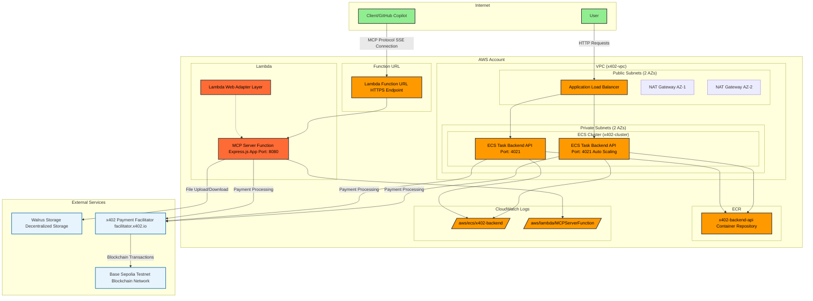

# AWS CDKでリモートMCPサーバーを構築するためのプロジェクト

## 動かし方

### x402用のコンテナイメージをECRにプッシュする方法

- コンテナイメージレジストリの作成

  ```bash
  # AWS CLIでECRリポジトリを作成
  aws ecr create-repository --repository-name x402-backend-api --region ap-northeast-1

  # 作成されたリポジトリのURIを確認
  aws ecr describe-repositories --repository-names x402-backend-api --region ap-northeast-1
  ```

- コンテナイメージのプッシュ

  ```bash
  # Account IDを取得
  export ACCOUNT_ID=$(aws sts get-caller-identity --query Account --output text)
  echo $ACCOUNT_ID

  # AWS ECRにログイン
  aws ecr get-login-password --region ap-northeast-1 | docker login --username AWS --password-stdin $ACCOUNT_ID.dkr.ecr.ap-northeast-1.amazonaws.com

  # Dockerイメージをビルド
  pnpm backend docker:build

  # イメージにECRのタグを付与
  docker tag x402-backend-api:latest $ACCOUNT_ID.dkr.ecr.ap-northeast-1.amazonaws.com/x402-backend-api:latest

  # ECRにプッシュ
  docker push $ACCOUNT_ID.dkr.ecr.ap-northeast-1.amazonaws.com/x402-backend-api:latest
  ```

### 環境変数の設定

`.env` を `/Users/harukikondo/git/overflow2025/pkgs/cdk/` に作成して以下の値をセットする。

```bash
# Required environment variables
FACILITATOR_URL=https://facilitator.x402.io
NETWORK=base-sepolia
ADDRESS=0x1234567890123456789012345678901234567890
ENDPOINT_PATH=/download/:blobId
PRIVATE_KEY=your_private_key_here
```

### 依存関係のインストール

```bash
pnpm install
```

### diff

```bash
pnpm cdk diff
```

### deploy

```bash
pnpm cdk run deploy '*' --require-approval never
```

### ECSタスクの状況確認

デプロイ後、ECSタスクが正常に起動しているかを確認する方法：

```bash
# ECSクラスターの確認
aws ecs list-clusters

# サービスの状況確認
aws ecs describe-services --cluster x402-cluster --services x402-backend-api

# タスクの状況確認
aws ecs list-tasks --cluster x402-cluster --service-name x402-backend-api

# タスクの詳細確認（TASK_ARNは上記コマンドで取得）
aws ecs describe-tasks --cluster x402-cluster --tasks TASK_ARN

# ログの確認
aws logs tail /aws/ecs/x402-backend --follow
```

### トラブルシューティング

ECSタスクが起動しない場合の対処法：

1. **イメージが存在するか確認**:

   ```bash
   aws ecr describe-images --repository-name x402-backend-api
   ```

2. **環境変数が正しく設定されているか確認**:

   - `.env`ファイルが正しい場所にあるか
   - 必要な環境変数がすべて設定されているか

3. **ログを確認**:
   ```bash
   aws logs tail /aws/ecs/x402-backend --follow
   ```

### GitHub Copilotから呼び出す

上記デプロイで得られたもののうち、 `CdkStack.MCPServerUrl` の値を利用する。

以下の設定を `settings.json` に追加する

```json
"aws-x402-walrus-mcp": {
  "type": "sse",
  "url": "<上記でデプロイしたもの>/mcp",
  "headers": {
    "VERSION": "1.2",
  }
}
```

### test MCP

```bash
pnpm cdk run test-mcp
```

### destroy

```bash
pnpm cdk run destroy --force '*'
```

## 本スタックでデプロイするリソースの全体像

### アーキテクチャ図



### デプロイされるAWSリソース

#### 1. **ネットワーク層**

- **VPC**: カスタムVPC (x402-vpc)
- **パブリックサブネット**: 2つのAZ（アベイラビリティゾーン）
- **プライベートサブネット**: 2つのAZ
- **インターネットゲートウェイ**: インターネット接続用
- **NATゲートウェイ**: プライベートサブネットからのアウトバウンド接続用

#### 2. **コンテナサービス (ECS Fargate)**

- **ECSクラスター**: `x402-cluster`
- **Application Load Balancer**: HTTP/HTTPSトラフィック分散
- **ECSサービス**: `x402-backend-api`
  - CPU: 512 units
  - メモリ: 1024 MiB
  - ポート: 4021
  - ヘルスチェック: `/health`
  - オートスケーリング対応

#### 3. **サーバーレス (Lambda)**

- **MCPサーバー関数**: Node.js 22.x
  - **Lambda Web Adapter**: HTTPサーバーをLambdaで実行
  - Express.jsアプリケーション
  - ポート: 8080
  - メモリ: 1024 MB
  - タイムアウト: 5分
- **Function URL**: HTTPS エンドポイント（認証不要）

#### 4. **コンテナレジストリ**

- **ECR Repository**: `x402-backend-api`
  - マルチアーキテクチャ対応（linux/amd64）
  - バックエンドAPIのDockerイメージ保存

#### 5. **ログ管理**

- **CloudWatch Logs**:
  - ECSタスクログ: `/aws/ecs/x402-backend`
  - Lambda関数ログ: `/aws/lambda/MCPServerFunction`
  - ログ保持期間: 1週間

#### 6. **セキュリティ**

- **セキュリティグループ**:
  - ALB: ポート80（HTTP）受信許可
  - ECSタスク: ポート4021（ALBからのみ）受信許可
- **IAM ロール**:
  - ECSタスク実行ロール（ECRアクセス権限）
  - Lambda実行ロール（基本実行権限）

### 外部サービス連携

#### 1. **Walrus Storage**

- 分散ストレージサービス
- ファイルアップロード/ダウンロード機能
- MCPサーバーから直接アクセス

#### 2. **x402 Payment Facilitator**

- マイクロペイメント処理
- USDC決済システム
- facilitator.x402.io経由

#### 3. **Base Sepolia Testnet**

- Ethereumテストネットワーク
- ブロックチェーン取引処理
- スマートコントラクト実行

### 通信フロー

1. **GitHub Copilot → MCP Server**:

   - SSE (Server-Sent Events) 接続
   - Function URL経由でLambda関数にアクセス
   - MCP プロトコルでの通信

2. **User → Backend API**:

   - HTTP/HTTPS リクエスト
   - Application Load Balancer経由
   - ECS Fargateタスクで処理

3. **Payment Processing**:

   - x402 Facilitator経由でマイクロペイメント
   - Base Sepolia テストネットでブロックチェーン処理

4. **File Storage**:
   - Walrus 分散ストレージでファイル管理
   - MCPサーバーから直接操作

### 運用・監視

- **ヘルスチェック**: ALBとECSでの自動ヘルスチェック
- **ログ監視**: CloudWatch Logsでの集約ログ管理
- **自動復旧**: ECSサービスでの自動タスク再起動
- **スケーリング**: トラフィックに応じた自動スケーリング

### プロンプト例

- **アップロード**

  ```bash
  Upload this file to Walrus.
  File path: /path/to/your/file.txt
  Storage period: 10
  use aws-x402-walrus-mcp
  ```

  レスポンス例

  ```json
  {
    "status": "success",
    "blobId": "eY-foaTn9LTwqfxy0Q_wW4YURADxG_MZK-nrtjhSjGk",
    "blobUrl": "https://aggregator.walrus-testnet.walrus.space/v1/blobs/eY-foaTn9LTwqfxy0Q_wW4YURADxG_MZK-nrtjhSjGk",
    "endEpoch": 89,
    "suiUrl": "https://suiscan.xyz/testnet/object/0xee852beb1aa45d8740024881e81253568b22861175eda61e5ab8be755123b9f7"
  }
  ```

- **ダウンロード**

  ```bash
  Download the file from Walrus.
  BlobID: eY-foaTn9LTwqfxy0Q_wW4YURADxG_MZK-nrtjhSjGk
  Save location: /Users/harukikondo/git/overflow2025/pkgs/mcp/samples/downloaded.txt
  ```
